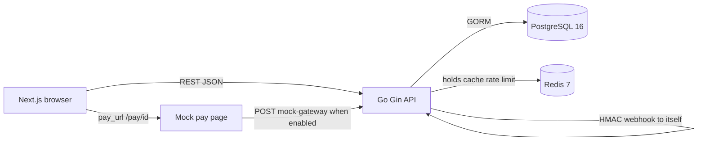
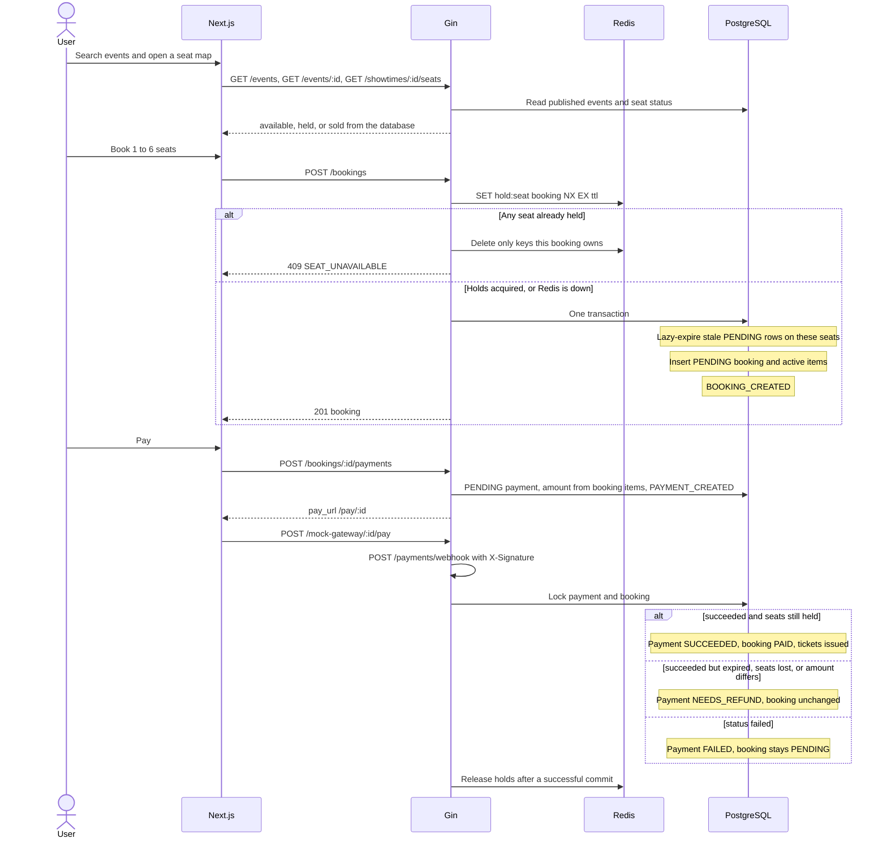
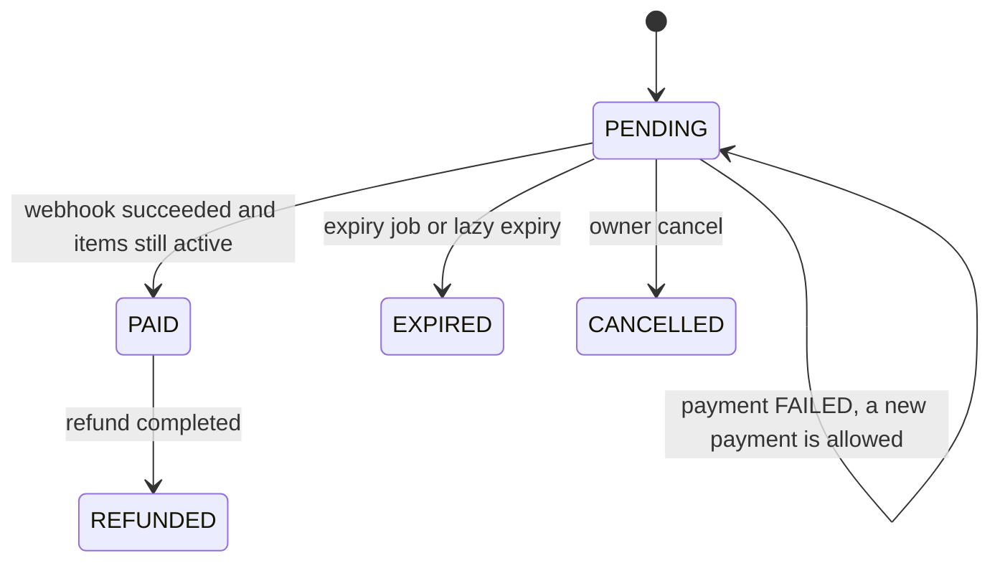
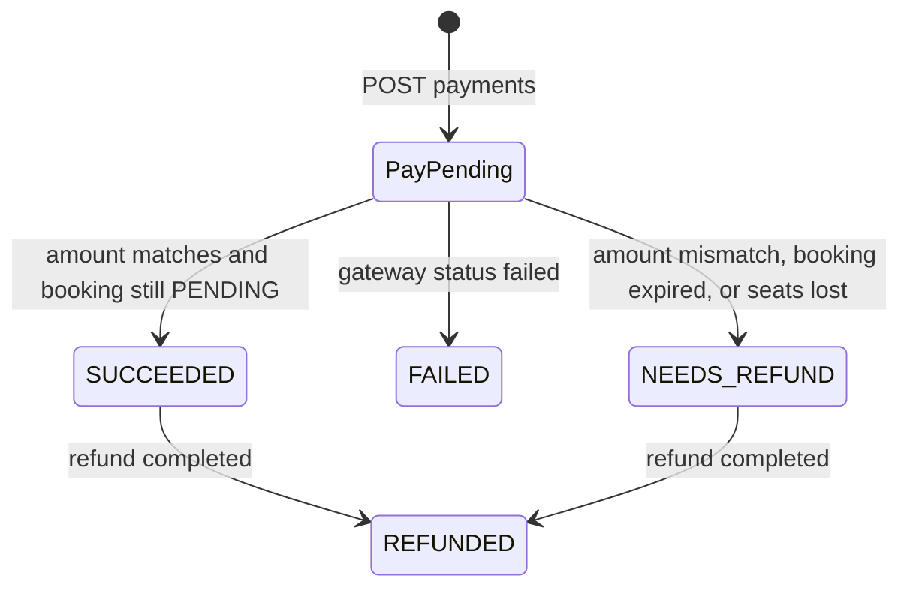
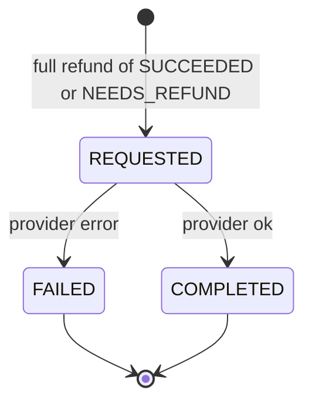

# Flow

Derived from the Go services and the Gin routes. Money is int64 satang. Time is UTC.

## 1. Architecture

- Frontend: Next.js App Router. All API calls go through `frontend/src/lib/api.ts`. QR codes are drawn in the browser from `ticket.code`.
- Backend: Gin under `/api/v1`, plus `GET /healthz`. Handlers call services; services call repositories. JWT (HS256) and bcrypt. CORS is the single `CORS_ORIGIN` value (`*` is rejected).
- PostgreSQL is the source of truth. SQL migrations only. Startup fails if required env is missing or the schema is unversioned, dirty, or behind the embedded migrations.
- Redis is only seat holds (`hold:{seat_id}`), the public event-list cache (30s), and rate limits. A Redis error while taking holds falls through to the database. The partial unique index on active seat items is what prevents a double sale.
- The mock gateway route exists only when `MOCK_GATEWAY_ENABLED=true`. It reads the amount from the database, signs the raw body, and POSTs `/api/v1/payments/webhook`.
- An expiry job runs every 30s. Shutdown stops that job after the HTTP server drains.

## 2. Booking and payment

Hold TTL is `SEAT_HOLD_TTL_SECONDS` (default 600). Client prices are ignored. One live PENDING booking per user per showtime. Booking create is limited to 10/min per user. Login is 5/min per IP and email.

Expiry: the job locks due PENDING rows (`FOR UPDATE SKIP LOCKED`), sets `EXPIRED`, deactivates items, writes `BOOKING_EXPIRED` (`HOLD_EXPIRED`, actor `SYSTEM`), then releases Redis holds. Creating a booking does the same lazy expiry inside its transaction when a stale hold blocks the requested seats.

## 3. States

A duplicate webhook on `SUCCEEDED`, `FAILED`, `NEEDS_REFUND`, or `REFUNDED` changes nothing.

`COMPLETED` sets the payment to `REFUNDED`, voids tickets, and sets the booking to `REFUNDED` only if it was `PAID`. Seats are released only when the showtime has not started. A `FAILED` refund leaves the payment and booking as they were. A later attempt is a new refund request. Re-processing a finished refund returns the same row and writes no new event.

`REFUND_REJECTED` is an audit event for a refused request. It does not insert a refund row.

Check-in sets a `VALID` ticket of a `PAID` booking to `USED`. The booking status does not change. A used ticket blocks a later refund request.

## 4. Audit events

`booking_events` and `payment_events` are append-only. A state change and its event commit in one transaction. A rolled-back failure is written afterward on the plain connection. Webhook rejections that never change a payment (`INVALID_SIGNATURE`, `MALFORMED_PAYLOAD`, lookup failure) commit `WEBHOOK_RECEIVED` and `WEBHOOK_REJECTED` together.

| When | Event | Outcome | reason_code |
|---|---|---|---|
| Booking created | `BOOKING_CREATED` | SUCCESS | |
| Booking rejected | `BOOKING_CREATE_FAILED` | FAILURE | `SEAT_UNAVAILABLE`, `VALIDATION_FAILED`, `TOO_MANY_SEATS`, `SHOWTIME_NOT_ON_SALE`, `SEAT_NOT_IN_SHOWTIME`, … |
| Hold expired | `BOOKING_EXPIRED` | SUCCESS | `HOLD_EXPIRED` |
| Owner cancel | `BOOKING_CANCELLED` | SUCCESS | `USER_CANCELLED` |
| Cancel refused | `BOOKING_CANCEL_REJECTED` | FAILURE | `BOOKING_NOT_FOUND`, `BOOKING_NOT_PENDING` |
| Payment created | `PAYMENT_CREATED` | SUCCESS | |
| Payment create refused | `PAYMENT_CREATE_FAILED` | FAILURE | `BOOKING_NOT_PAYABLE`, `BOOKING_EXPIRED`, `VALIDATION_FAILED`, … |
| Webhook accepted for processing | `WEBHOOK_RECEIVED` | SUCCESS | |
| Bad signature, bad JSON, unknown id, or lookup/processing error | `WEBHOOK_REJECTED` | FAILURE | `INVALID_SIGNATURE`, `MALFORMED_PAYLOAD`, `UNKNOWN_PAYMENT`, `INTERNAL_ERROR` |
| Webhook paid | `PAYMENT_SUCCEEDED`, then `BOOKING_PAID`, then `TICKETS_ISSUED` | SUCCESS | |
| Gateway declined | `PAYMENT_FAILED` | FAILURE | `GATEWAY_DECLINED` |
| Same terminal webhook again | `PAYMENT_DUPLICATE_IGNORED` | IGNORED | `DUPLICATE_EVENT` |
| Amount differs | `PAYMENT_AMOUNT_MISMATCH` | FAILURE | `AMOUNT_MISMATCH` |
| Paid after expiry, or seats no longer held | `PAYMENT_AFTER_EXPIRY` | FAILURE | `BOOKING_EXPIRED` or `SEAT_LOST` |
| Refund opened | `REFUND_REQUESTED` | SUCCESS | |
| Refund refused or id missing | `REFUND_REJECTED` | FAILURE | `REFUND_NOT_ELIGIBLE`, `TICKET_ALREADY_USED`, `AMOUNT_EXCEEDS_PAYMENT`, `REFUND_ALREADY_EXISTS`, `VALIDATION_FAILED`, `UNKNOWN_PAYMENT`, `NOT_FOUND` |
| Provider ok | `REFUND_COMPLETED` and `BOOKING_REFUNDED` | SUCCESS | |
| Provider error, or unexpected `provider_ref` | `REFUND_FAILED` | FAILURE | `PROVIDER_FAILED` or `INTERNAL_ERROR` |
| Check-in | `TICKET_CHECKED_IN` | SUCCESS | |
| Check-in refused | `TICKET_CHECK_IN_REJECTED` | FAILURE | `TICKET_ALREADY_USED`, `TICKET_VOID`, `NOT_FOUND` |

`NEEDS_REFUND` is a payment status. The money is recorded and no tickets are issued. An admin refunds it with the same request/process routes as a successful payment.

## 5. API

Paths match `docs/api.md` and the routes registered in `main.go`, `routes.go`, and `admin.go`. Admin routes require an admin JWT: 401 `UNAUTHENTICATED`, 403 `FORBIDDEN`.

| Method | Path | Auth |
|---|---|---|
| GET | `/healthz` | public |
| GET | `/api/v1/events` | public |
| GET | `/api/v1/events/:id` | public |
| GET | `/api/v1/showtimes/:id/seats` | public |
| POST | `/api/v1/auth/register` | public |
| POST | `/api/v1/auth/login` | public |
| GET | `/api/v1/me` | user |
| POST | `/api/v1/bookings` | user |
| GET | `/api/v1/bookings` | user |
| GET | `/api/v1/bookings/:id` | user |
| DELETE | `/api/v1/bookings/:id` | user |
| POST | `/api/v1/bookings/:id/payments` | user |
| GET | `/api/v1/payments/:id` | user |
| POST | `/api/v1/payments/webhook` | gateway HMAC |
| POST | `/api/v1/mock-gateway/:payment_id/pay` | none; route absent unless mock gateway is enabled |
| GET | `/api/v1/tickets` | user |
| GET | `/api/v1/tickets/:code` | user |
| GET | `/api/v1/admin/stats` | admin |
| GET | `/api/v1/admin/events` | admin |
| POST | `/api/v1/admin/events` | admin |
| PUT | `/api/v1/admin/events/:id` | admin |
| DELETE | `/api/v1/admin/events/:id` | admin |
| POST | `/api/v1/admin/events/:id/showtimes` | admin |
| PUT | `/api/v1/admin/showtimes/:id` | admin |
| GET | `/api/v1/admin/bookings` | admin |
| GET | `/api/v1/admin/bookings/:id/timeline` | admin |
| GET | `/api/v1/admin/payments` | admin |
| POST | `/api/v1/admin/payments/:id/refunds` | admin |
| GET | `/api/v1/admin/refunds` | admin |
| POST | `/api/v1/admin/refunds/:id/process` | admin |
| POST | `/api/v1/admin/tickets/:code/check-in` | admin |

There is no showtime delete route. Request and error details are in `docs/api.md`.
