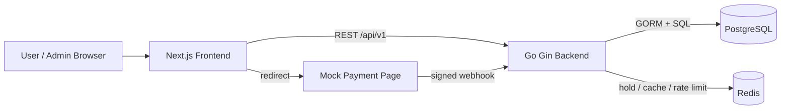
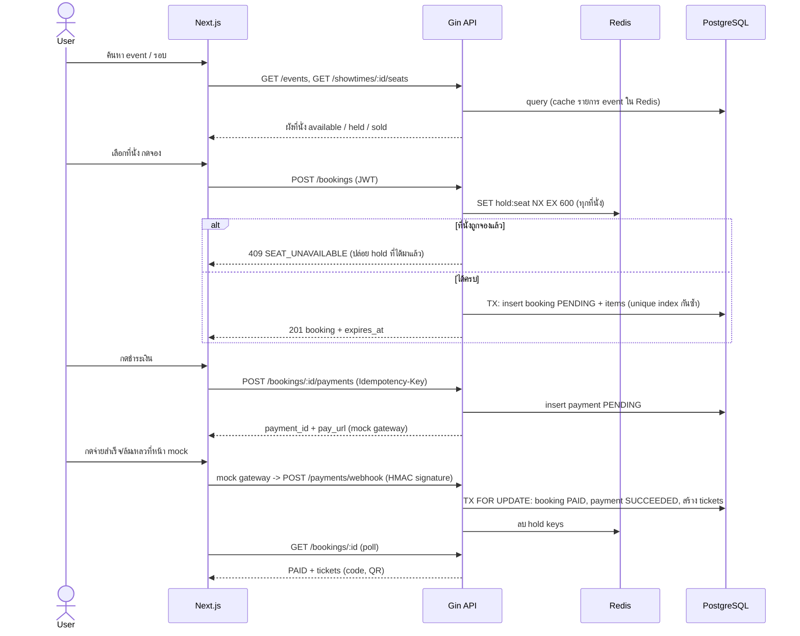
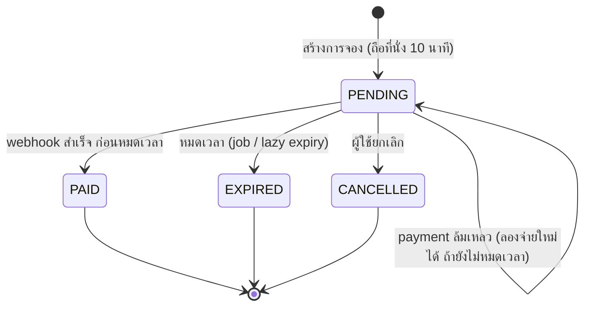

### 1 สถาปัตยกรรม

### 2 Flow การจองและชำระเงิน

### 3 State ของ Booking

### 4 Edge cases ที่ต้องมี test

- 2 คนจองที่นั่งเดียวกันพร้อมกัน: สำเร็จ 1 ราย อีกรายได้ 409
- เลือก 3 ที่นั่ง แต่ที่ 3 ถูกคนอื่นถือ: ต้องปล่อยที่ 1-2 ที่ถือไปแล้ว
- Redis ล่ม: ระบบยังกันจองซ้ำได้ด้วย unique index
- หมดเวลาแล้วที่นั่งกลับมาว่าง
- webhook ซ้ำ: ไม่ออกตั๋วซ้ำ
- webhook ลายเซ็นผิด: 401
- จ่ายสำเร็จหลังหมดเวลา: บันทึกเป็น `NEEDS_REFUND` ไม่ปล่อยให้หายเงียบ ๆ (ต้องให้คนตัดสิน business rule)
- user ธรรมดาเรียก admin API: 403

### 5 รายการ API (ตั้งต้น)

| Method | Path | สิทธิ์ | หมายเหตุ |
|---|---|---|---|
| GET | `/healthz` | public | เช็ก DB + Redis |
| POST | `/api/v1/auth/register`, `/auth/login` | public | |
| GET | `/api/v1/me` | user | |
| GET | `/api/v1/events?q=&from=&to=` | public | cache 30 วินาที |
| GET | `/api/v1/events/:id` | public | พร้อมรอบฉาย |
| GET | `/api/v1/showtimes/:id/seats` | public | สถานะที่นั่ง |
| POST | `/api/v1/bookings` | user | `{showtime_id, seat_ids[]}` |
| GET | `/api/v1/bookings`, `/bookings/:id` | user | เฉพาะของตัวเอง |
| DELETE | `/api/v1/bookings/:id` | user | ยกเลิกได้เฉพาะ PENDING |
| POST | `/api/v1/bookings/:id/payments` | user | ต้องมี `Idempotency-Key` |
| POST | `/api/v1/payments/webhook` | gateway | ตรวจ HMAC |
| POST | `/api/v1/mock-gateway/:payment_id/pay` | dev only | `{result: success\|fail}` |
| GET | `/api/v1/tickets`, `/tickets/:code` | user | |
| CRUD | `/api/v1/admin/events` | admin | |
| POST/PUT/DELETE | `/api/v1/admin/events/:id/showtimes`, `/admin/showtimes/:id` | admin | สร้างรอบ + สร้างที่นั่งอัตโนมัติ (แถว x คอลัมน์) |
| GET | `/api/v1/admin/bookings`, `/admin/stats` | admin | |
| POST | `/api/v1/admin/tickets/:code/check-in` | admin | |
| GET | `/api/v1/payments/:id` | user (เจ้าของ) | status + failure_code + failure_message |
| GET | `/api/v1/admin/bookings/:id/timeline` | admin | booking_events + payment_events รวมตามเวลา |
| GET | `/api/v1/admin/payments?status=` | admin | รวมรายการ NEEDS_REFUND |
| POST | `/api/v1/admin/payments/:id/refunds` | admin | สร้างคำขอคืนเงิน (Idempotency-Key) |
| POST | `/api/v1/admin/refunds/:id/process` | admin | ประมวลผลผ่าน mock provider |
| GET | `/api/v1/admin/refunds` | admin | |
