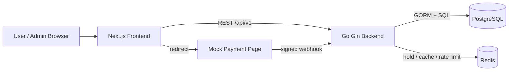
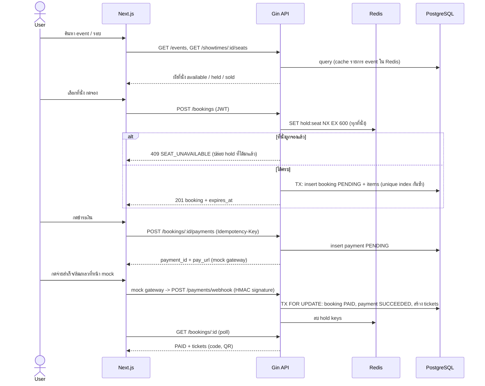
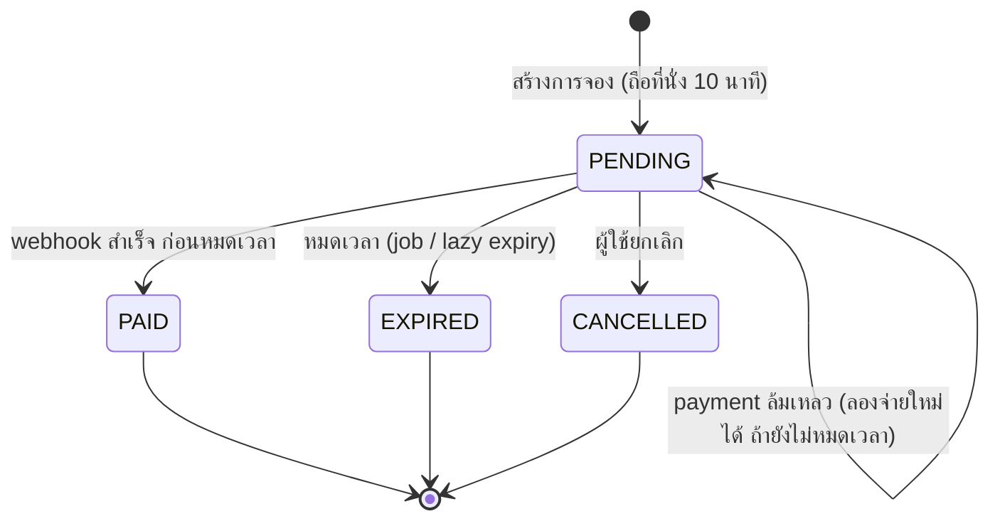

# Flow

Derived from the Go services and the Gin routes. Money is int64 satang. Time is UTC.

## 1. Architecture

## 2. Booking and payment

## 3. States

## 4. Edge cases

- 2 คนจองที่นั่งเดียวกันพร้อมกัน: สำเร็จ 1 ราย อีกรายได้ 409
- เลือก 3 ที่นั่ง แต่ที่ 3 ถูกคนอื่นถือ: ต้องปล่อยที่ 1-2 ที่ถือไปแล้ว
- Redis ล่ม: ระบบยังกันจองซ้ำได้ด้วย unique index
- หมดเวลาแล้วที่นั่งกลับมาว่าง
- webhook ซ้ำ: ไม่ออกตั๋วซ้ำ
- webhook ลายเซ็นผิด: 401
- จ่ายสำเร็จหลังหมดเวลา: บันทึกเป็น `NEEDS_REFUND` ไม่ปล่อยให้หายเงียบ ๆ (ต้องให้คนตัดสิน business rule)
- user ธรรมดาเรียก admin API: 403

## 5. API

Paths match `docs/api.md` and the routes registered in `main.go`, `routes.go`, and `admin.go`. Admin routes require an admin JWT: 401 `UNAUTHENTICATED`, 403 `FORBIDDEN`.

| Method | Path | Auth |
|---|---|---|
| GET | `/healthz` | public |
| GET | `/api/v1/events` | public |
| GET | `/api/v1/events/:id` | public |
| GET | `/api/v1/showtimes/:id/seats` | public |
| POST | `/api/v1/auth/register` | public |
| POST | `/api/v1/auth/login` | public |
| GET | `/api/v1/me` | user |
| POST | `/api/v1/bookings` | user |
| GET | `/api/v1/bookings` | user |
| GET | `/api/v1/bookings/:id` | user |
| DELETE | `/api/v1/bookings/:id` | user |
| POST | `/api/v1/bookings/:id/payments` | user |
| GET | `/api/v1/payments/:id` | user |
| POST | `/api/v1/payments/webhook` | gateway HMAC |
| POST | `/api/v1/mock-gateway/:payment_id/pay` | none; route absent unless mock gateway is enabled |
| GET | `/api/v1/tickets` | user |
| GET | `/api/v1/tickets/:code` | user |
| GET | `/api/v1/admin/stats` | admin |
| GET | `/api/v1/admin/events` | admin |
| POST | `/api/v1/admin/events` | admin |
| PUT | `/api/v1/admin/events/:id` | admin |
| DELETE | `/api/v1/admin/events/:id` | admin |
| POST | `/api/v1/admin/events/:id/showtimes` | admin |
| PUT | `/api/v1/admin/showtimes/:id` | admin |
| GET | `/api/v1/admin/bookings` | admin |
| GET | `/api/v1/admin/bookings/:id/timeline` | admin |
| GET | `/api/v1/admin/payments` | admin |
| POST | `/api/v1/admin/payments/:id/refunds` | admin |
| GET | `/api/v1/admin/refunds` | admin |
| POST | `/api/v1/admin/refunds/:id/process` | admin |
| POST | `/api/v1/admin/tickets/:code/check-in` | admin |

There is no showtime delete route. Request and error details are in `docs/api.md`.
