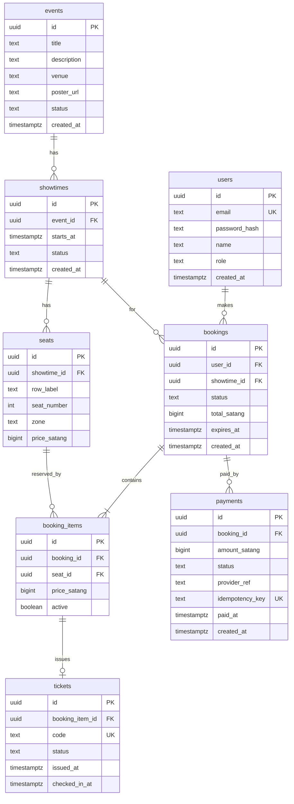

### 5.1 ER Diagram



### 5.2 SQL (ใช้เป็นต้นแบบ migration `0001_init.up.sql`)

```sql
CREATE EXTENSION IF NOT EXISTS pgcrypto;

CREATE TABLE users (
    id            uuid PRIMARY KEY DEFAULT gen_random_uuid(),
    email         text NOT NULL UNIQUE,
    password_hash text NOT NULL,
    name          text NOT NULL,
    role          text NOT NULL DEFAULT 'user' CHECK (role IN ('user','admin')),
    created_at    timestamptz NOT NULL DEFAULT now()
);

CREATE TABLE events (
    id          uuid PRIMARY KEY DEFAULT gen_random_uuid(),
    title       text NOT NULL,
    description text NOT NULL DEFAULT '',
    venue       text NOT NULL,
    poster_url  text NOT NULL DEFAULT '',
    status      text NOT NULL DEFAULT 'published' CHECK (status IN ('draft','published','archived')),
    created_at  timestamptz NOT NULL DEFAULT now()
);

CREATE TABLE showtimes (
    id         uuid PRIMARY KEY DEFAULT gen_random_uuid(),
    event_id   uuid NOT NULL REFERENCES events(id) ON DELETE CASCADE,
    starts_at  timestamptz NOT NULL,
    status     text NOT NULL DEFAULT 'on_sale' CHECK (status IN ('on_sale','closed','cancelled')),
    created_at timestamptz NOT NULL DEFAULT now()
);
CREATE INDEX idx_showtimes_event ON showtimes(event_id);
CREATE INDEX idx_showtimes_starts ON showtimes(starts_at);

CREATE TABLE seats (
    id           uuid PRIMARY KEY DEFAULT gen_random_uuid(),
    showtime_id  uuid NOT NULL REFERENCES showtimes(id) ON DELETE CASCADE,
    row_label    text NOT NULL,
    seat_number  int  NOT NULL,
    zone         text NOT NULL DEFAULT 'standard',
    price_satang bigint NOT NULL CHECK (price_satang >= 0),
    UNIQUE (showtime_id, row_label, seat_number)
);

CREATE TABLE bookings (
    id           uuid PRIMARY KEY DEFAULT gen_random_uuid(),
    user_id      uuid NOT NULL REFERENCES users(id),
    showtime_id  uuid NOT NULL REFERENCES showtimes(id),
    status       text NOT NULL DEFAULT 'PENDING'
                 CHECK (status IN ('PENDING','PAID','EXPIRED','CANCELLED')),
    total_satang bigint NOT NULL CHECK (total_satang >= 0),
    expires_at   timestamptz NOT NULL,
    created_at   timestamptz NOT NULL DEFAULT now()
);
CREATE INDEX idx_bookings_user ON bookings(user_id);
CREATE INDEX idx_bookings_pending_expiry ON bookings(expires_at) WHERE status = 'PENDING';

CREATE TABLE booking_items (
    id           uuid PRIMARY KEY DEFAULT gen_random_uuid(),
    booking_id   uuid NOT NULL REFERENCES bookings(id) ON DELETE CASCADE,
    seat_id      uuid NOT NULL REFERENCES seats(id),
    price_satang bigint NOT NULL CHECK (price_satang >= 0),
    active       boolean NOT NULL DEFAULT true
);
-- กันจองซ้ำ: 1 ที่นั่งมี item ที่ active ได้แค่ 1 รายการ (ด่านสุดท้ายที่สำคัญที่สุด)
CREATE UNIQUE INDEX uq_booking_items_active_seat ON booking_items(seat_id) WHERE active = true;
CREATE INDEX idx_booking_items_booking ON booking_items(booking_id);

CREATE TABLE payments (
    id              uuid PRIMARY KEY DEFAULT gen_random_uuid(),
    booking_id      uuid NOT NULL REFERENCES bookings(id),
    amount_satang   bigint NOT NULL CHECK (amount_satang >= 0),
    status          text NOT NULL DEFAULT 'PENDING'
                    CHECK (status IN ('PENDING','SUCCEEDED','FAILED','NEEDS_REFUND')),
    provider_ref    text NOT NULL DEFAULT '',
    idempotency_key text NOT NULL UNIQUE,
    paid_at         timestamptz,
    created_at      timestamptz NOT NULL DEFAULT now()
);
CREATE INDEX idx_payments_booking ON payments(booking_id);

CREATE TABLE tickets (
    id              uuid PRIMARY KEY DEFAULT gen_random_uuid(),
    booking_item_id uuid NOT NULL UNIQUE REFERENCES booking_items(id),
    code            text NOT NULL UNIQUE,
    status          text NOT NULL DEFAULT 'VALID' CHECK (status IN ('VALID','USED','VOID')),
    issued_at       timestamptz NOT NULL DEFAULT now(),
    checked_in_at   timestamptz
);
```

